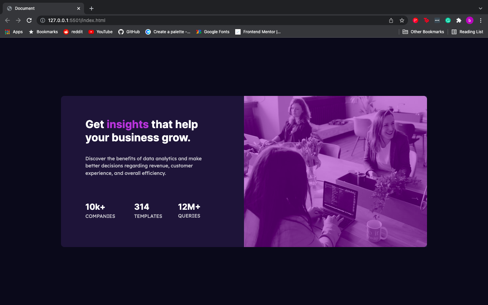

# Frontend Mentor - Stats preview card component solution

This is a solution to the [Stats preview card component challenge on Frontend Mentor](https://www.frontendmentor.io/challenges/stats-preview-card-component-8JqbgoU62). Frontend Mentor challenges help you improve your coding skills by building realistic projects.

## Table of contents

- [Overview](#overview)
  - [The challenge](#the-challenge)
  - [Screenshot](#screenshot)
  - [Links](#links)
- [My process](#my-process)
  - [Built with](#built-with)
  - [What I learned](#what-i-learned)
  - [Continued development](#continued-development)
  - [Useful resources](#useful-resources)
- [Author](#author)

## Overview

In this read-me, I inted to go over my thought process on how I tackled this challenge, some of the difficulties I faced, and also the main areas of improvement i'd like to focus on. This challenge was a fun way for me to practise making a responsive web page and i learnt alot in the process.

### The challenge

Users should be able to:

- View the optimal layout depending on the users device's screen size

### Screenshots

### Links

- Solution URL: (https://www.frontendmentor.io/solutions/stats-preview-card-8CpPTy5o6)
- Live Site URL: (https://bradwishart.github.io/Stats-Preview-Card/)

## My process

- Initial Planning:

To begin this challenge I started by looking over the design files included with the download. After this I then decided the styles to use throught the project. I started with the background and worked my way forward in a logical manner.

- First Phase:

Firstly I set up a live view of the web page and split my screen so I can view my code and the web page simultaneously. This allows me to view any changes I make as the file is formatted/saved.

The first phase is to write out the basic HTML, this gives me a template to work with and build on. After this I add the main elements to the page in order.

- Second Phase:

As the HTML starts to take shape, the next step is to add the CSS Style sheet. I prefer to work with my CSS in an external way, as it is more clear for me to have HTML and CSS on seperate pages.

Now I am able to start adding basic styles and colours to the HTML so it becomes more visually accurate to the reference images. The whole time I am applying HTML and CSS I refer back to the design images to ensure my project is as close as possible.

- Third Phase:

Now I begin to add code that makes the web page responsive, in this challenge I wanted to practise using the flex-box model.

- Summary:

Overall I had fun building this stats preview card, it was a fairly straight-forward challenge but tested my abilities to make something professional and to a pre-determined spec. During this project I faced some difficulties that I will cover in a later section, but I ensured that before I moved onto the next part of the project, I was 100% happy with the code and content I had produced. This way there is no confusion when I came back to my code, and I was able to move onto the next step with a clear mind.

### Built with

- Semantic HTML5 markup
- CSS custom properties
- Flexbox

### What I learned

This challenge taught me the importance of planning out a project properly before tackling it head on. No matter what size project it is, it still requires some thought behind it.

As I finished developing the desktop version of the challenge I was unprepared for the changed i would have to make for the mobile version, and this lead me to to a few road blocks that I had to overcome. The main difficulty I encountered was the positioning of certain elements on the screen, but using a few different techniques such as the setting the position of the element to absolute and being able to manuver it wherever I needed.

As well as this I realised that using responsive values for text is an important step in making the web page as a whole responsive, as it allows the text to change in size alongside the other elements on screen.

All in all I learned that no matter how simple a project may seem, sometimes it can provide you with a few opportunities to learn and grow.

### Continued development

I set out to improve my abilities and foundational knowledge of HTML and CSS, and I still believe that tackling these smaller challenges, and working my way up to the bigger and more complex ones is the best approach for me.

Id still like to develop my responsive web development skills, and focus on implementing classes to my CSS to clean it up further.

### Useful resources

- [Resource 1](https://developer.mozilla.org/en-US/docs/Web/CSS/CSS_Flexible_Box_Layout/Aligning_Items_in_a_Flex_Container) - This helped me to understand how to center elements on both horizontal and vertical axis.

- [Resource 2](https://smartbear.com/learn/performance-monitoring/what-is-mobile-first/) - Even though I found this concept after I had completed this challenge, i still think its a valuable resource on mobile first workflow!

- [Resource 3](https://www.freecodecamp.org/learn/responsive-web-design/) - This course on responsive web design continues to get me out of sticky situations!

## Author

- Brad Wishart

- Frontend Mentor - [@bradwishart](https://www.frontendmentor.io/profile/bradwishart)

- Git Hub - [bradwishart](https://github.com/bradwishart)
